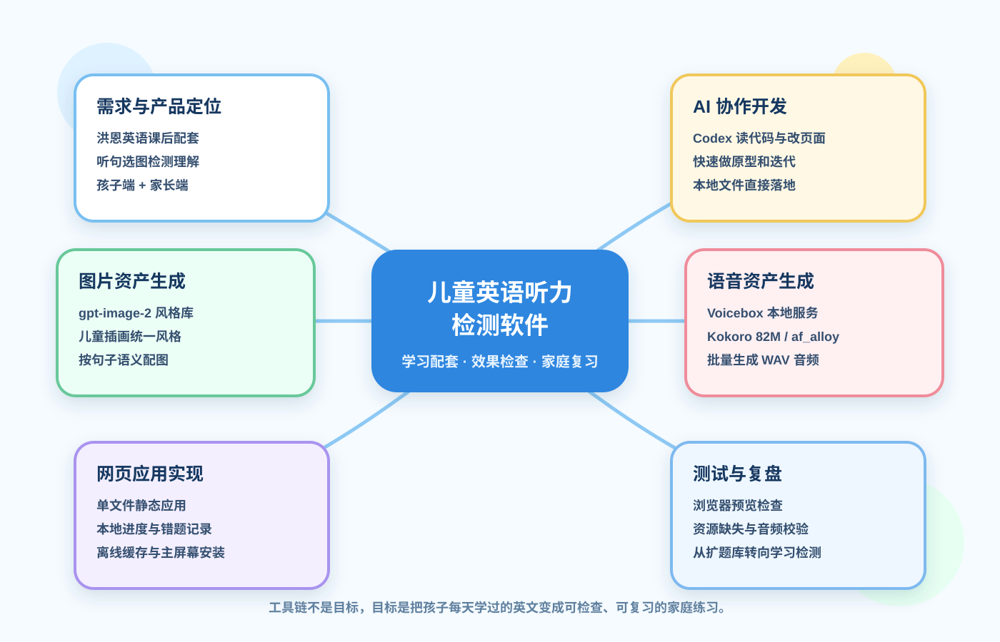

# 从洪恩英语到家庭听力检测工具：一个儿童英语学习软件的开发复盘

## 起点：不是再做一个“洪恩英语”

这个软件的想法，来自我给孩子订阅“洪恩英语”之后的一个真实感受：孩子每天确实在学，也能跟着 App 玩完一节课，但家长很难判断他到底听懂了多少。

很多儿童英语产品的重点是“教”：动画、互动、奖励、闯关、角色陪伴，这些对启蒙很重要。但家庭里还缺一个更轻的工具，用来回答几个朴素问题：

- 今天学过的词，孩子还能不能听出来？
- 一个句子不看文字，只听声音，孩子能不能理解？
- 哪些词或句型反复错，需要复习？
- 家长能不能快速看到学习效果，而不是只看到“完成了”？

所以这个项目一开始就不应该定位成另一个大型英语学习 App，而应该是“洪恩英语之后的配套检测工具”。它的价值不在于替代主课，而在于帮助家长检查主课有没有真正转化为听力理解。

## 第一版：把目标压到足够小

第一版只做一件事：听一句英文短句，从四张图片里选出匹配的一张。

这个形式很简单，但它刚好覆盖了低龄英语启蒙里最关键的一环：听音辨义。孩子不需要拼写，不需要阅读长句，也不需要解释语法，只需要证明自己听懂了。

为了让原型尽快可用，我先做了几个基础模块：

- 孩子端口：Lulu、Qiqi、Mimi 三个独立进度。
- 课程主题：动物、食物、日常，以及后来扩展出的颜色形状、位置空间、天气自然。
- 题目形式：每题一句英文音频，四张图片选择。
- 辅助功能：英文提示、中文提示、语速控制、错题记录。
- 家长端：查看每个孩子完成度、星星数、错题数和最近错题。

做完这一版之后，软件已经可以试玩，但也暴露出一个问题：如果只是不断扩主题，它很容易变成一个“泛英语题库”。这和最初的需求并不完全一致。

## 工具链：AI 负责提速，人负责判断

这次开发用到的工具可以分成几类。

首先是 Codex，用来读现有文件、修改页面、生成脚本、做本地验证。它最大的作用不是“替我想一个软件”，而是让我能持续把想法落到本地文件里，并且快速迭代。

图片方面使用了 gpt-image-2 风格库的儿童插画方向。听句选图对图片要求很高：不是好看就行，而是必须准确表达句子含义。比如 “The bag is beside the chair.” 这类句子，图片里书包和椅子的相对位置必须一眼看明白，否则孩子选错不代表没听懂，可能只是图不清楚。

语音方面最后选择了 Voicebox 里的 Kokoro 82M / af_alloy。之前测试过一些声音，有的太机械，有的不适合儿童听力练习。最后这个声音更稳定、自然，适合作为软件里的标准英文女声。

测试方面，主要用本地浏览器预览和资源校验来确认页面能打开、图片能加载、音频文件存在、离线缓存没有缺失。这个阶段发现过图标缺失、端口不一致、音频服务未启动等问题，都是靠实际运行才暴露出来的。

## 最大的产品调整：从“扩课程”转向“检测学习效果”

中途我做过一次内容扩充，把课程从 3 个主题扩到 6 个主题，从 45 题扩到 90 题。这个动作本身有价值，因为它验证了课程结构、批量音频生成、图片资产接入、离线缓存都能继续扩展。

但扩完之后，我重新意识到：这个软件的核心不应该是“题越多越好”，而应该是“题和孩子当天学过的内容越匹配越好”。

如果孩子今天在洪恩里学的是颜色和水果，那么软件里最有价值的不是随机再做 30 道动物题，而是立刻生成或选择 10 道相关听力小测，检查他是否真的听懂了 red、yellow、apple、banana，以及简单句型 “The apple is red.”

因此，后续更合理的方向是做“每日练习包”：

- 家长选择或录入今天学过的词和句型。
- 系统生成 5-10 道听力检测题。
- 孩子完成后，家长看到正确率和错题。
- 错题自动进入复习池，几天后再次出现。

这比单纯扩一个大题库更贴近家庭真实使用场景。

## 图片资产的教训：配图不是装饰，是题目的一部分

这个项目里，图片不是 UI 装饰，而是题目的答案本身。

一开始新增主题时，我复用了旧图。这样可以快速跑通流程，但会带来语义不够精准的问题。例如 “The blue bag is big.” 如果只是用一张普通蓝书包图，孩子并不能从图里判断 big；“The child has an umbrella.” 如果伞不突出，孩子也可能误选。

所以后面需要为新增主题做专属图片包：每张图都围绕一句话生成，让动作、颜色、位置、天气这些信息足够明确。对儿童学习软件来说，图的准确性比图的精美度更重要。

## 当前阶段

目前这个软件已经进入“可试玩原型”阶段。它具备了核心闭环：

- 孩子可以进入自己的端口练习。
- 每道题可以听英文音频。
- 可以通过图片选择回答。
- 家长可以查看完成情况和错题。
- 图片和语音都可以本地化，不依赖在线播放。

但它还不是一个真正成熟的学习产品。下一阶段要解决的，不是继续堆功能，而是让它更贴近孩子每天真实学习内容。

## 下一步计划

下一步我会优先考虑三个方向。

第一，做“每日练习包”。让家长能按当天学习内容生成或选择题目，而不是只按固定主题闯关。

第二，强化家长端数据。家长真正关心的不是星星数量，而是哪几个词没掌握、哪类句子容易错、最近几天有没有进步。

第三，建立复习机制。孩子第一次做对不代表掌握，反复错也不应该只是记录下来。错题应该自动进入复习计划，隔天或隔几天重新出现。

## 结论

这次开发最大的收获不是做出了一个页面，而是把产品定位想清楚了。

它不是另一个洪恩英语，也不应该和主课软件竞争。它应该站在家庭学习场景里，做一件更具体的事：把孩子在主课里学过的英文，变成家长能检查、孩子能复习、结果能沉淀的小测工具。

工具链可以让开发速度变快，但真正决定软件价值的，还是这个问题：它是不是解决了家庭里真实存在的学习反馈缺口。
