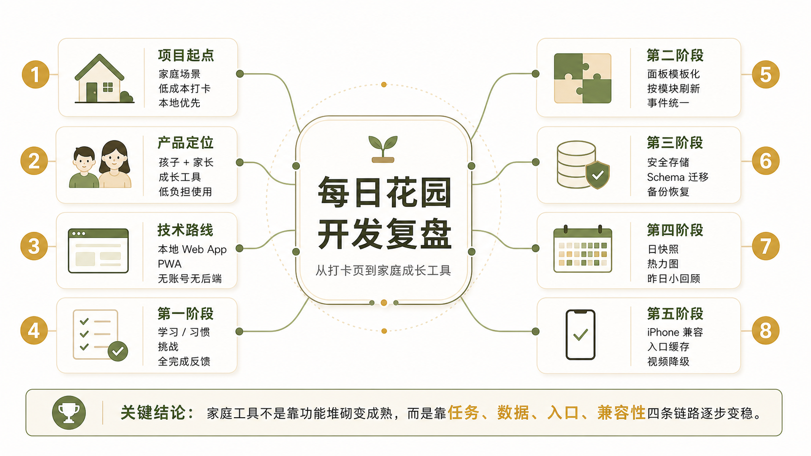

# 每日花园开发复盘：一个家庭成长工具是怎么从打卡页长出来的

## 摘要

`每日花园` 最初只是一个给孩子做日常习惯打卡的小网页，目标很简单：降低家长每天催促的成本，让孩子对“完成任务”有更直接的反馈。

但在持续使用过程中，这个项目逐步从一个“能勾选的页面”，演化成了一套更完整的家庭成长工具。它后来具备了这些能力：

- 多孩子独立面板
- 孩子模式 / 家长模式
- 习惯、学习、挑战三类任务联动
- 成长卡、奖励兑换、成长记录
- 打卡热力图、昨日小回顾、月度回顾
- 本地存储、备份恢复、版本迁移
- PWA 桌面图标、移动端适配、老 iPhone 兼容

这篇文章不是教程，而是一篇开发复盘。重点不是“代码怎么写”，而是这款软件在产品和工程上是如何一步步成型的，以及哪些决定真正影响了它能不能长期使用。

## 一、项目背景

这个项目不是从完整需求文档开始的，而是从一个非常具体的家庭场景开始的：

- 孩子的习惯养成需要连续反馈
- 单靠口头提醒，执行力和情绪稳定性都不够
- 家长需要一个足够轻的工具，随手打开就能用

这个背景直接决定了产品的第一版方向：

- 不做账号系统
- 不依赖服务器
- 不要求下载 App
- 先解决“今天能不能顺利打卡”这个核心问题

所以第一版并没有追求“大而全”，而是优先保证：

1. 任务足够清楚
2. 完成反馈足够直接
3. 手机上打开足够方便
4. 家长能低成本维护

## 二、产品定位

如果从产品类型来看，`每日花园` 其实不是传统意义上的“习惯打卡 App”，更接近一个面向家庭内部使用的轻量成长系统。

它最终要同时满足三类需求：

### 1. 孩子的使用需求

- 知道今天要做什么
- 完成后有明确反馈
- 有连续完成的成就感
- 奖励规则能看懂

### 2. 家长的使用需求

- 能管理多个孩子的内容
- 能调整打卡项目和挑战
- 能回看成长记录和历史情况
- 数据不要轻易丢

### 3. 工具本身的现实约束

- 尽量离线可用
- 手机上像 App 一样好进
- 老设备也尽量能跑
- 维护成本不能太高

从这个角度看，后面所有功能和重构，其实都围绕一个问题展开：

> 它到底是一个“页面”，还是一个能长期被家庭使用的产品？

## 三、技术路线：为什么一开始选择本地 Web App

这个项目的第一个关键决策，不是视觉，也不是交互，而是技术路线。

当时可以走的方向大致有三种：

1. 原生 App
2. 小程序 / 云端应用
3. 本地 Web App

最后选的是第三种，原因很明确。

### 1. 启动成本最低

本地 Web App 不需要先解决：

- 账号体系
- 后端存储
- 上架审核
- 多端同步架构

这让产品可以非常快地进入真实使用。

### 2. 交付方式最轻

家庭工具最大的问题不是“做不出来”，而是“别人愿不愿意用”。

如果一个工具需要：

- 注册
- 下载
- 登录
- 配权限

那它很可能在正式使用前就已经被放弃了。

而本地 Web App 可以做到：

- 打开链接就能用
- 可以添加到手机桌面
- 数据只存在本机

这对家庭场景是非常合适的。

### 3. 迭代速度快

这个项目后面经历了很多轮调整，如果一开始就背上完整原生工程，迭代成本会明显更高。

从复盘角度看，这个决定是对的：它让产品先跑起来，再逐渐长出工程化能力。

## 四、第一阶段：先把打卡闭环跑通

第一阶段的目标非常单纯：让用户能把一天的任务打完，并感受到反馈。

这一阶段的核心闭环包括：

- 今日学习
- 今日好习惯
- 超级挑战
- 完成率反馈
- 全完成奖励

从产品层面看，这一阶段解决的是“任务驱动”。

从工程层面看，这一阶段的代码通常会有几个特点：

- 结构直给
- 重复较多
- 优先交付，不优先抽象

这没有问题。因为在需求还不稳定时，过早抽象经常比重复更危险。

但随着模块增多，第一版写法很快开始暴露出问题。

## 五、第二阶段：从“能跑”到“能继续迭代”

这一步是整个项目里非常关键的转折。

### 1. 多孩子面板的重复问题

项目最初是按人物分别组织页面的。`lulu / qiqi / mimi` 三套结构非常相似，这种写法在初期很高效，但会带来明显的后续成本：

- 改 UI 要改三处
- 新增交互要改三处
- 极容易漏改

所以后面做了一个关键重构：把孩子面板模板化，保留一份结构定义，再根据当前孩子数据渲染内容。

这个改动的价值，不只是“代码更好看”，而是它直接降低了后续开发的回归风险。

### 2. 渲染机制从整页刷到按模块刷新

项目进入第二阶段后，首页内容已经不少了：

- 今日学习
- 今日习惯
- 超级挑战
- 成长能量
- 积分银行
- 热力图
- 成长档案

如果任何一个动作都触发大面积重绘，短期也许还能接受，但一旦数据和交互都增加，性能和调试成本都会上升。

所以后面逐步做了两层收口：

- 结构上，把首页整理成 `任务区 / 反馈区 / 回顾区`
- 渲染上，增加按模块刷新，而不是每次都整页重刷

这是一次典型的“产品形态没变，但可维护性明显提升”的重构。

### 3. 事件绑定统一

另一个容易在页面型项目里出问题的地方，是事件绑定分散。

如果大量逻辑都靠单个节点逐一绑定，一旦重渲染或局部替换，很容易出现：

- 重复绑定
- 漏绑定
- 状态不一致

后续把不少高频交互改成了更统一的调度方式，这让页面状态和事件链路稳定了很多。

## 六、第三阶段：把存储和备份做成产品能力

一个家庭工具能不能长期用，取决于两个问题：

1. 数据会不会丢
2. 改过的内容能不能回来

这也是项目从“页面功能”走向“产品能力”的关键阶段。

### 1. 存储从直接写 localStorage 走向安全封装

前期直接写本地存储是合理的，但随着数据类型变多，必须开始处理这些问题：

- 某个 key 读取失败怎么办
- JSON 损坏怎么办
- 旧字段升级怎么办

所以后面逐步补上了：

- `safeGetItem`
- `safeSetItem`
- `safeJsonParse`
- `schema version`
- `migrateStorage()`

这一步的意义在于：开始把数据当作“有生命周期的资产”来处理，而不是页面临时状态。

### 2. 备份恢复从“能导出”升级成“能恢复”

一开始很多工具都会做一个导出按钮，但导出不等于恢复。

真正有价值的，是恢复后能不能保留用户在软件里长期积累和修改过的内容。

后面这套备份能力逐步扩展到包括：

- 习惯配置
- 超级挑战配置
- 成长记录
- 兑换记录
- 自定义奖励

并且导入前自动备份当前状态，避免误操作直接覆盖本地数据。

这一步之后，软件才真正具备了长期使用的底座。

## 七、第四阶段：从“今天完成了吗”走向“历史如何被理解”

如果一个系统只能记录今天完成了什么，那它依然只是一个打卡页。

真正把它往成长工具方向推了一步的，是后面加入的“历史理解能力”。

### 1. 日快照是一个关键基础设施

项目后来补上了 `dailySnapshots`。这看起来像存储细节，但实际上影响了很多上层功能：

- 热力图
- 月报
- 昨日回顾
- 旧数据兼容

有了每日快照，系统才开始真正“记住每一天”。

### 2. 热力图不是展示技术，而是要让家里人看懂

热力图这一块前后改了多轮，背后反映的是一个非常典型的产品判断：

工程师喜欢连续周视图，但家庭用户更需要“月份边界清楚、哪天是哪格一眼能认出来”。

所以后来做的事情包括：

- 只显示近三个月
- 当前月完整展示
- 月份之间明确分段
- 严格按月份切块
- 点格子可看当天详情

这其实是一种很典型的产品取舍：

> 放弃一部分工程师审美上的“标准热力图”，换来家庭用户更低的理解成本。

### 3. 昨日小回顾：把历史反馈拉回首页

用户真实想知道的，很多时候不是“一个月前怎么样”，而是：

> 昨天到底漏了哪些，今天能不能补上？

所以后来没有把这个需求继续压在热力图里，而是直接在首页任务区顶部增加了“昨日小回顾”卡片。

这个决定很重要，因为它说明系统开始从“展示历史”转向“用历史影响今天的行动”。

## 八、第五阶段：移动端兼容性，才是项目真正变复杂的地方

如果只在电脑浏览器里验证，这个项目很早就能说“可用了”。

但只要它真的面向家庭长期使用，就一定会进入移动端现实，尤其是老设备。

这一阶段最典型的问题来自 iPhone 7 Plus。

### 1. 外链资源会破坏“本地工具”的稳定性

曾经有一次很典型的问题：

- 软件本体是本地页面
- 但页面还依赖在线字体
- 某些 Wi‑Fi 环境下，软件表现成“打不开”

这类问题表面上像网络问题，实际上是入口对外链资源存在依赖。

这件事带来的经验非常明确：

> 只要目标是长期放在手机桌面使用，就要尽量保证页面本身离线自洽。

### 2. PWA 入口、桌面图标和缓存，是另一层系统

后面又遇到了另一类问题：

- 桌面图标 404
- 旧入口失效
- 新入口可打开但桌面图标仍走旧路径

这类问题不是业务代码本身出了错，而是入口链路和缓存策略没有完全收口。

最终的修正方向是：

- 统一正式入口
- 保留旧入口兼容跳转
- 同步修正 manifest 和 service worker
- 处理桌面图标缓存

从工程复盘看，这类问题说明：PWA 不是“顺手加一个图标”，而是一整套独立的入口系统。

### 3. 老设备上的媒体播放限制比想象中更严格

连续 7 天彩蛋后来升级成了视频彩蛋，但老 iPhone 上的播放限制比预期更复杂：

- 自动播放限制
- 带声音自动播放限制
- 某些编码容器不稳定
- 本地文件和网页容器的兼容差异

最后这块没有强求所有设备都走同样的最优体验，而是做了务实的降级策略：

- 优先视频
- 不行就退图
- 明确告诉用户当前实际使用了什么素材

这是一种典型的移动端产品思路：

> 兼容性不是追求所有设备体验完全一致，而是保证每种设备都有可接受的结果。

## 九、第六阶段：界面优化的本质，是不断回答“谁在用、先看什么”

后面很多界面调整，如果只看表面，会觉得是小修小补，比如：

- 顶部人物识别条
- 首页顺序调整
- 孩子模式和家长模式信息差异
- 悬浮提示该不该常驻

但这些修改本质上都在回答同一个问题：

> 在家庭场景里，当前最重要的信息是什么？

最后沉淀下来的一些判断是：

- “当前是谁”比“当前是什么模式”更需要持续可见
- 首页应该先是今天的任务，再是完成反馈，最后才是历史回顾
- 孩子模式不需要看到太多分析型数据，但可以保留热力图这类有激励作用的反馈

这类优化没有哪个特别“炫”，但它们会直接决定这个产品是不是顺手。

## 十、几个关键产品判断

如果把整个过程浓缩成几条最关键的判断，我会选下面这些。

### 1. 先用本地 Web App 验证价值，而不是一开始就做原生 App

这让项目能非常快地进入真实使用，而不是花大量时间搭基础设施。

### 2. 备份恢复比很多“新功能”都更重要

一旦用户开始持续修改内容、录入成长记录，恢复能力就变成长期使用的前提。

### 3. 面向家庭的热力图，应该优先可读性，而不是工程师审美

月份边界清楚、哪天是哪格一眼能认出来，比连续周布局更重要。

### 4. 孩子模式和家长模式不是“换个按钮颜色”，而是信息层级的重新组织

不同角色需要看到的信息并不一样，这直接影响首页结构和交互优先级。

### 5. 移动端稳定性来自入口和降级，而不只是页面主逻辑

很多“打不开”“点不动”“视频不播”的问题，根源根本不在业务代码里。

## 十一、这个项目里踩过的几个典型坑

### 1. 重复结构会让后续每次改动都变贵

多孩子面板早期按人物分开写是快，但后面几乎每个 UI 改动都要交三倍成本。

### 2. 没有日级明细时，历史解释会失真

后来热力图详情之所以出现“旧记录全部显示未完成”的问题，本质上就是早期快照只存了完成数量，没有逐项明细。

### 3. 入口和缓存问题不能只在本地 file 环境验证

本地能开，不等于桌面图标能开；Safari 能开，不等于 PWA 能开。

### 4. 老设备兼容不能只靠推理，必须真机验证

尤其是媒体播放、自动播放、service worker 和桌面图标路径问题。

## 十二、如果重新做一次，我会更早做什么

### 1. 更早统一组件层

弹层、提示、人物条、卡片系统，如果更早统一，后面会少很多显示层反复收口。

### 2. 更早设计快照结构

只要目标里包含历史回顾，日快照就不该只存汇总数。

### 3. 更早把“本地入口”和“线上入口”分开治理

这能明显减少 PWA、GitHub Pages、桌面图标之间互相影响的问题。

## 十三、结论

回头看，这个项目并不是靠一次大设计完成的，而是靠一系列很小、但都很贴近真实使用的判断堆出来的。

它的发展路径大致可以概括为：

1. 先解决今天能不能打卡
2. 再解决多个孩子能不能长期共用
3. 再解决数据能不能留下来
4. 再解决历史能不能被看懂
5. 最后解决它在真实手机环境里能不能稳定存在

这也是我对这个项目最重要的复盘结论：

> 一个家庭工具不是靠功能堆砌变成熟的，而是靠“任务、数据、入口、兼容性”这几条关键链路一点点变稳。

如果后面还要继续写这一系列复盘，我会接着写下一篇：

**《每日花园第二阶段复盘：当一个家庭工具开始需要真正的稳定性》**
